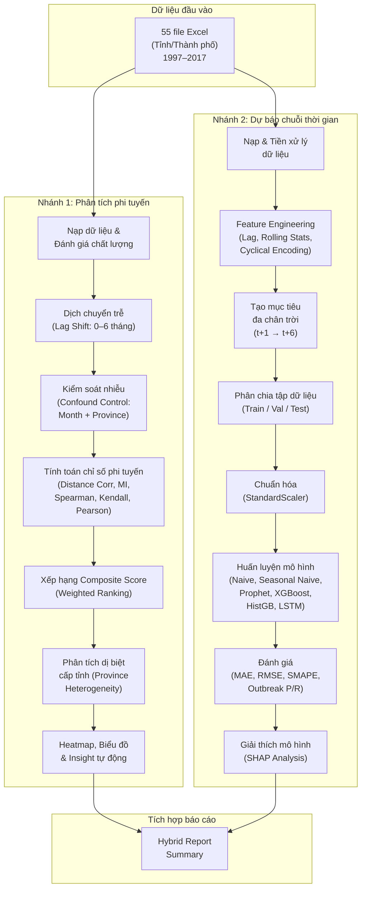

# 3. Methodology

## 3.1 Overview of Approach

### 3.1.1 Tổng quan kiến trúc

Đồ án này trình bày một **hệ thống phân tích lai (Hybrid Analysis Pipeline)** nhằm nghiên cứu mối quan hệ giữa các yếu tố khí hậu, xã hội và dịch bệnh truyền nhiễm tại Việt Nam, đồng thời xây dựng các mô hình dự báo dịch bệnh đa tỉnh, đa chân trời thời gian. Hệ thống được thiết kế theo **kiến trúc pipeline hai nhánh song song**, tích hợp kết quả tại bước cuối cùng để tạo ra báo cáo tổng hợp (Hybrid Report).

Hai nhánh chính bao gồm:

1. **Nhánh phân tích tương quan phi tuyến (Non-Linear Correlation Analysis Pipeline):** Đo lường và xếp hạng các mối quan hệ phụ thuộc phi tuyến có trễ (lagged non-linear dependencies) giữa các biến dịch bệnh, khí hậu và xã hội trên toàn bộ 55 tỉnh/thành phố. Phân tích sử dụng các phép đo phi tuyến bao gồm Distance Correlation, Mutual Information, Spearman Correlation, Kendall Tau và Pearson Correlation, kết hợp với kỹ thuật kiểm soát yếu tố nhiễu (confound control) theo tháng và tỉnh.

2. **Nhánh dự báo chuỗi thời gian (Forecasting Pipeline):** Xây dựng và đánh giá nhiều mô hình dự báo tỷ lệ mắc bệnh theo kiến trúc **MIMO (Multi-Input Multi-Output)**, với cửa sổ đầu vào 12 tháng và tầm nhìn dự báo lên đến 6 tháng tương lai. Các mô hình bao gồm: Naive, Seasonal Naive (baselines), Prophet (chuỗi thời gian cổ điển), XGBoost, HistGradientBoosting (học máy dạng bảng), và LSTM (học sâu chuỗi).

3. **Module tích hợp (Hybrid Report Builder):** Tổng hợp kết quả từ hai nhánh trên thành một báo cáo thống nhất, kết nối phát hiện phi tuyến với hiệu năng dự báo.

### 3.1.2 Sơ đồ kiến trúc pipeline tổng thể

<!-- TODO: Chèn hình ảnh sơ đồ pipeline tổng thể -->
<!-- Gợi ý: Vẽ sơ đồ bằng draw.io hoặc Mermaid với cấu trúc sau -->



### 3.1.3 Quy trình thực thi tự động

Toàn bộ hệ thống được điều phối bởi ba file runner chính:

| File | Chuc nang | Dau ra |
|:---|:---|:---|
| `run_all.py` | Thuc thi toan bo pipeline du bao cho mot kich ban | Metrics, predictions, plots, SHAP |
| `run_nonlinear.py` | Chay rieng phan tich tuong quan phi tuyen | Non-linear tables, plots, insights |
| `run_hybrid.py` | **Dieu phoi chinh**: chay phi tuyen + 6 kich ban du bao tu dong | Tat ca ket qua trong `results/` |

Toan bo cau hinh thi nghiem duoc quan ly tap trung qua `configs/default.yaml`. File `run_hybrid.py` ho tro `--skip-nonlinear`, `--skip-scenarios`, va `--scenarios N` de chay chon loc.

---

## 3.2 Data & Data Pipeline

### 3.2.1 Nguồn dữ liệu

Dữ liệu được thu thập từ các nguồn thống kê y tế và khí tượng chính thức của Việt Nam, bao gồm dữ liệu giám sát dịch bệnh truyền nhiễm, dữ liệu khí tượng thủy văn và dữ liệu dân số – xã hội. Tập dữ liệu bao gồm **55 tỉnh/thành phố** của Việt Nam, với chuỗi thời gian theo **tần suất tháng** trong giai đoạn **1997–2017** (khoảng 20 năm, tương đương ~240 điểm dữ liệu mỗi tỉnh).

<!-- TODO: Bổ sung nguồn cụ thể: Tổng cục Thống kê, Trung tâm khí tượng quốc gia... -->

Mỗi tỉnh/thành phố được lưu trữ trong một file Excel riêng biệt (định dạng `.xlsx`), đặt tên theo quy ước `squeezed_<Tên tỉnh>.xlsx`. Mỗi file chứa các quan sát hàng tháng với các nhóm biến sau:

#### Bảng 1: Mô tả các nhóm biến trong tập dữ liệu

| Nhóm biến | Tên biến | Mô tả |
|:---|:---|:---|
| **Thời gian** | `year`, `month` | Năm và tháng quan sát |
| **Bệnh truyền nhiễm** | `Dengue_fever_rates` | Tỷ lệ mắc sốt xuất huyết (/100.000 dân) |
|  | `Influenza_rates` | Tỷ lệ mắc cúm mùa (/100.000 dân) |
|  | `Diarrhoea_rates` | Tỷ lệ mắc tiêu chảy (/100.000 dân) |
|  | `Dengue_fever_cases`, `Influenza_cases`, `Diarrhoea_cases` | Số ca mắc tuyệt đối tương ứng |
| **Khí hậu** | `Total_Evaporation` | Tổng lượng bốc hơi (mm) |
|  | `Total_Rainfall` | Tổng lượng mưa (mm) |
|  | `Max_Daily_Rainfall` | Lượng mưa ngày lớn nhất (mm) |
|  | `n_raining_days` | Số ngày mưa trong tháng |
|  | `Average_temperature` | Nhiệt độ trung bình (°C) |
|  | `Max_Average_Temperature` | Nhiệt độ trung bình cao nhất (°C) |
|  | `Min_Average_Temperature` | Nhiệt độ trung bình thấp nhất (°C) |
|  | `Max_Absolute_Temperature` | Nhiệt độ tuyệt đối cao nhất (°C) |
|  | `Min_Absolute_Temperature` | Nhiệt độ tuyệt đối thấp nhất (°C) |
|  | `Average_Humidity` | Độ ẩm trung bình (%) |
|  | `Min_Humidity` | Độ ẩm tối thiểu (%) |
|  | `n_hours_sunshine` | Số giờ nắng trong tháng |
| **Xã hội – Dân số** | `population_male`, `population_female` | Dân số nam/nữ |
|  | `population_urban`, `population_countryside` | Dân số thành thị/nông thôn |

### 3.2.2 Đặc điểm dữ liệu và mức độ nhiễu

- **Kích thước tổng thể:** ~55 tỉnh × ~240 tháng ≈ 13.200 quan sát (trước khi loại bỏ giá trị thiếu).
- **Tính mùa vụ:** Dữ liệu bệnh truyền nhiễm (đặc biệt sốt xuất huyết) biểu hiện **tính mùa vụ rõ rệt** với đỉnh dịch vào mùa mưa (khoảng tháng 6–11 tại khu vực phía Nam).
- **Phân bố lệch phải (right-skewed):** Tỷ lệ mắc bệnh có phân bố không đối xứng, với đa số quan sát ở mức thấp và một số ít đỉnh dịch có giá trị rất cao (heavy tail).
- **Dữ liệu thiếu:** Một số tỉnh/thành phố có chuỗi thời gian ngắn hơn (chẳng hạn Đắk Nông, Điện Biên do tách tỉnh), dẫn đến giá trị missing ở giai đoạn đầu. Tỷ lệ missing cũng khác nhau giữa các biến và các tỉnh.
- **Biến tĩnh hoặc gần tĩnh:** Một số cặp (tỉnh, biến) có phương sai gần bằng 0 hoặc số giá trị unique quá ít, đặc biệt ở các biến dân số – xã hội ở các tỉnh nhỏ.

### 3.2.3 Quy trình tiền xử lý dữ liệu (Data Pipeline)

Quy trình tiền xử lý được thực hiện qua hai module chính: `data_loader.py` (nạp và làm sạch) và `feature_engineering.py` (tạo đặc trưng).

#### Bước 1: Nạp dữ liệu (Data Loading)

Hàm `load_all_provinces()` trong module `data_loader.py` thực hiện:

1. **Quét file:** Tự động tìm tất cả file `.xlsx` trong thư mục `data/raw/`, sắp xếp theo thứ tự ABC.
2. **Kiểm tra cột bắt buộc:** Đảm bảo mỗi file chứa ít nhất hai cột `year` và `month`.
3. **Gán nhãn tỉnh:** Tên tỉnh được trích xuất từ tên file (stem), gán vào cột `province`.
4. **Tạo cột thời gian chuẩn:** Cột `date` được tạo ở định dạng `YYYY-MM-01` từ các cột `year` và `month`.
5. **Loại bỏ cột không cần thiết:** Các cột thừa như `Unnamed: 0`, `year_month` được tự động xóa.
6. **Tính toán tỷ lệ (tùy chọn):** Khi cờ `compute_rate_per100k = true`, hệ thống tự tính tỷ lệ mắc bệnh per 100.000 dân từ số ca mắc tuyệt đối (`cases_col`) chia cho tổng dân số (`population_male + population_female`).

#### Bước 2: Xử lý giá trị thiếu (Missing Value Imputation)

Sau khi nối (concatenate) tất cả các DataFrame thành một bảng duy nhất, dữ liệu được sắp xếp theo `(province, date)` và xử lý missing theo chiến lược **forward-fill rồi backward-fill trong từng tỉnh riêng biệt** (`ffill().bfill()` per province group). Chiến lược này:
- Tránh **rò rỉ dữ liệu xuyên tỉnh** (cross-province leakage): giá trị của tỉnh A không được dùng để lấp giá trị thiếu của tỉnh B.
- Ưu tiên giá trị gần nhất theo thời gian trong cùng tỉnh, phù hợp với đặc tính tự tương quan (autocorrelation) vốn có của chuỗi thời gian.

#### Bước 3: Feature Engineering

Module `feature_engineering.py` thực hiện tạo đặc trưng từ dữ liệu thô theo ba kỹ thuật chính:

**a) Đặc trưng trễ (Lag Features):**

Đối với mỗi biến quan trọng (biến mục tiêu, biến khí hậu, biến xã hội, và tùy chọn biến bệnh khác), hệ thống tạo ra các đặc trưng trễ từ lag = 1 đến lag = `input_sequence_length` (mặc định: 12 tháng). Ví dụ: `Dengue_fever_rates_lag1`, `Total_Rainfall_lag3`, v.v. Phép tạo lag sử dụng `groupby(province).shift(lag)` để đảm bảo không xảy ra rò rỉ dữ liệu xuyên tỉnh.

Số lượng đặc trưng lag phụ thuộc vào `input_sequence_length`: với giá trị mặc định 12, mỗi biến số sẽ sinh ra 12 đặc trưng lag tương ứng, mô hình hóa ảnh hưởng lên đến 12 tháng quá khứ.

**b) Đặc trưng thống kê trượt (Rolling Statistics):**

Cho biến mục tiêu, hệ thống tính **trung bình trượt (rolling mean)** và **độ lệch chuẩn trượt (rolling std)** với các cửa sổ kích thước 3 và 6 tháng (áp dụng `shift(1)` trước khi rolling để tránh rò rỉ thông tin tương lai). Ví dụ:
- `Dengue_fever_rates_rollmean_3`: trung bình của 3 tháng gần nhất (đã shift 1).
- `Dengue_fever_rates_rollstd_6`: biến động 6 tháng gần nhất.

**c) Mã hóa tuần hoàn cho tháng (Cyclical Month Encoding):**

Để mô hình hóa tính chu kỳ của thời gian (tháng 12 → tháng 1 liên tục), biến `month` được mã hóa bằng hàm sin và cos:

$$month\_sin = \sin\left(\frac{2\pi \times month}{12}\right)$$

$$month\_cos = \cos\left(\frac{2\pi \times month}{12}\right)$$

Phép mã hóa này tạo ra hai đặc trưng liên tục, duy trì được khoảng cách tuần hoàn giữa các tháng (tháng 1 gần tháng 12 hơn tháng 6), vượt trội so với cách mã hóa one-hot hay giữ nguyên số nguyên.

#### Bước 4: Tạo mục tiêu đa chân trời (Multi-Horizon Target Creation)

Module `dataset_builder.py` tạo ra các biến mục tiêu tương lai bằng phép dịch ngược (negative shift) theo từng tỉnh:

$$y_{t+h} = \text{target}_{column}\text{.shift}(-h), \quad h \in \{1, 2, ..., H\}$$

với $H$ là số chân trời dự báo (mặc định: $H = 6$, tức dự báo từ t+1 đến t+6 tháng).

Kiến trúc này gọi là **MIMO (Multi-Input Multi-Output)**: một mô hình nhận đầu vào X tại thời điểm t và đồng thời xuất ra vector $[\hat{y}_{t+1}, \hat{y}_{t+2}, ..., \hat{y}_{t+H}]$, thay vì huấn luyện H mô hình riêng lẻ cho từng chân trời.

Sau bước này, tất cả các hàng chứa giá trị `NaN` (do shift về quá khứ hoặc tương lai) được loại bỏ, đảm bảo tập dữ liệu hoàn chỉnh cho bước huấn luyện.

#### Bước 5: Phân chia tập dữ liệu (Train/Val/Test Split)

Dữ liệu được phân chia theo **thời gian (temporal split)** — phương pháp phân chia duy nhất phù hợp cho bài toán chuỗi thời gian — để tránh rò rỉ thông tin từ tương lai:

| Tập dữ liệu | Giai đoạn | Mục đích |
|:---|:---|:---|
| **Train** | ≤ 31/12/2014 | Huấn luyện mô hình |
| **Validation** | 01/01/2015 – 31/12/2015 | Tinh chỉnh siêu tham số (hyperparameter tuning) |
| **Test** | 01/01/2016 – 31/12/2017 | Đánh giá hiệu năng cuối cùng |

Phép phân chia này được thiết kế sao cho:
- Toàn bộ quá trình tuning (grid search trên tập Val) diễn ra **trước khi** mô hình nhìn thấy tập Test.
- Sau khi chọn siêu tham số tốt nhất, mô hình được **huấn luyện lại trên tập Train + Val** và đánh giá trên tập Test.

#### Bước 6: Chuẩn hóa đặc trưng (Feature Normalization)

Toàn bộ đặc trưng số được chuẩn hóa bằng `StandardScaler` (z-score normalization):

$$x_{scaled} = \frac{x - \mu_{train}}{\sigma_{train}}$$

Trong đó $\mu_{train}$ và $\sigma_{train}$ được **tính duy nhất trên tập Train** và áp dụng cố định (transform) lên tập Val và Test. Điều này đảm bảo không xảy ra rò rỉ thống kê (statistics leakage) từ dữ liệu tương lai.

<!-- TODO: Chèn hình minh họa Data Pipeline (Hình 2) -->

---

## 3.3 Evaluation Protocol

### 3.3.1 Thiết kế giao thức đánh giá

Giao thức đánh giá được thiết kế nhằm đảm bảo tính **khách quan, tái lập được (reproducible)** và **có ý nghĩa thống kê**. Hệ thống đánh giá bao gồm ba tầng:

1. **Đánh giá hiệu năng dự báo tổng thể (Overall Forecasting Performance):** So sánh tất cả mô hình trên tập Test theo nhiều thước đo (metrics) tại từng chân trời dự báo.
2. **Đánh giá khả năng phát hiện đợt dịch (Outbreak Detection):** Đánh giá khả năng cảnh báo sớm các đợt bùng phát dịch cao bất thường.
3. **Kiểm định ý nghĩa thống kê (Statistical Significance Test):** Xác nhận sự vượt trội của mô hình so với baseline có ý nghĩa thống kê, không phải do ngẫu nhiên.

### 3.3.2 Các thước đo đánh giá (Evaluation Metrics)

#### a) Mean Absolute Error (MAE)

$$MAE = \frac{1}{n}\sum_{i=1}^{n}|y_i - \hat{y}_i|$$

MAE đo sai số trung bình tuyệt đối giữa giá trị thực và giá trị dự báo. Đây là **thước đo chính (primary metric)** trong đồ án, được báo cáo tại mỗi chân trời: MAE@1, MAE@2, ..., MAE@6. MAE có ưu điểm là robust (ít bị ảnh hưởng bởi outlier) và diễn giải trực quan (cùng đơn vị với biến mục tiêu).

#### b) Root Mean Squared Error (RMSE)

$$RMSE = \sqrt{\frac{1}{n}\sum_{i=1}^{n}(y_i - \hat{y}_i)^2}$$

RMSE phạt nặng hơn các sai số lớn so với MAE, phù hợp để đánh giá mô hình trong bối cảnh sai số lớn cần được phát hiện (ví dụ: bỏ sót đỉnh dịch). Được báo cáo song song: RMSE@1, RMSE@2, ..., RMSE@6.

#### c) Symmetric Mean Absolute Percentage Error (SMAPE)

$$SMAPE = \frac{100\%}{n}\sum_{i=1}^{n}\frac{|y_i - \hat{y}_i|}{(|y_i| + |\hat{y}_i|)/2}$$

SMAPE cung cấp thước đo sai số **theo tỷ lệ phần trăm**, cho phép so sánh giữa các loại bệnh hoặc các tỉnh có quy mô khác nhau. Giá trị SMAPE nằm trong khoảng [0%, 200%], với 0% là hoàn hảo. Xử lý đặc biệt: khi cả $y_i = \hat{y}_i = 0$, mẫu số được thay thế bằng 1 để tránh phép chia cho 0.

#### d) Outbreak Precision & Recall (tại phân vị thứ 95)

Để đánh giá khả năng cảnh báo sớm đợt bùng phát dịch, hệ thống định nghĩa **ngưỡng bùng phát (outbreak threshold)** bằng phân vị thứ 95 của phân bố giá trị thực trên tập Test:

$$threshold_{95} = P_{95}(y_{true})$$

Một quan sát được phân loại là "bùng phát" nếu giá trị $\geq threshold_{95}$.

- **Precision (Độ chính xác):** Trong số các trường hợp mô hình dự đoán là bùng phát, bao nhiêu phần trăm thực sự bùng phát?

$$Precision = \frac{TP}{TP + FP}$$

- **Recall (Độ phủ):** Trong số các trường hợp thực sự bùng phát, mô hình phát hiện được bao nhiêu?

$$Recall = \frac{TP}{TP + FN}$$

### 3.3.3 Kiểm định ý nghĩa thống kê

Để xác nhận rằng sự cải thiện của mô hình so với Seasonal Naive (baseline mùa vụ) không phải do ngẫu nhiên, hệ thống áp dụng **kiểm định Wilcoxon signed-rank test** (phiên bản phi tham số của paired t-test):

- **Giả thuyết $H_0$:** Phân bố sai số tuyệt đối (absolute errors) của mô hình và Seasonal Naive là như nhau.
- **Giả thuyết $H_1$:** Phân bố sai số tuyệt đối của hai phương pháp khác nhau có ý nghĩa thống kê.
- **Mức ý nghĩa:** $\alpha = 0.05$.

Kiểm định Wilcoxon phù hợp cho dữ liệu chuỗi thời gian vì **không yêu cầu giả định phân bố chuẩn** (normality assumption) — điều thường không thỏa mãn trong dữ liệu dịch bệnh có đuôi dài.

### 3.3.4 Đánh giá theo từng tỉnh (Per-Province Evaluation)

Ngoài đánh giá tổng thể, hệ thống tính **MAE riêng cho từng tỉnh** (sử dụng mô hình có MAE@1 thấp nhất toàn cục), cho phép xác định:
- Các tỉnh mà mô hình hoạt động tốt nhất / kém nhất.
- Mối liên hệ giữa hiệu năng và các yếu tố cụ thể (kích thước dữ liệu, mức độ biến động dịch bệnh, vùng địa lý).

### 3.3.5 Baselines và Benchmarks so sánh

Đồ án sử dụng hệ thống baselines đa tầng để đo lường mức cải thiện thực sự:

| Baseline | Phương pháp dự báo | Ý nghĩa |
|:---|:---|:---|
| **Naive** | $\hat{y}_{t+h} = y_t$ | Giá trị hiện tại dùng làm dự báo; đo hiệu quả tối thiểu |
| **Seasonal Naive** | $\hat{y}_{t+h} = y_{t-12+h-1}$ | Giá trị cùng tháng năm trước; đo tính mùa vụ |
| **Prophet** | Chuỗi thời gian cổ điển (phân tách xu hướng + mùa vụ) | Đại diện phương pháp truyền thống phổ biến |

Các mô hình ML/DL (XGBoost, HistGB, LSTM) phải vượt trội có ý nghĩa so với các baseline trên thì mới được coi là có đóng góp khoa học.

---

## 3.4 System Design / Model Design

### 3.4.1 Tổng quan kiến trúc mô hình

Hệ thống mô hình dự báo được thiết kế theo **kiến trúc MIMO đa mô hình (Multi-Model MIMO Architecture)**: mỗi mô hình nhận cùng một bộ đặc trưng đầu vào và xuất ra đồng thời vector dự báo cho $H$ chân trời thời gian ($H = 6$ trong cấu hình mặc định). Kiến trúc này cho phép so sánh công bằng giữa các loại mô hình trên cùng dữ liệu.

Sáu mô hình được triển khai, thuộc bốn nhóm phương pháp:

### 3.4.2 Mô hình Baseline

#### a) Naive Forecast

Mô hình đơn giản nhất: dự báo cho tất cả các chân trời bằng giá trị hiện tại.

$$\hat{y}_{t+h} = y_t, \quad \forall h \in \{1, ..., H\}$$

Phương pháp dự báo này giả định "không có sự thay đổi" (random walk), là **lower-bound benchmark** cho mọi mô hình phức tạp hơn.

#### b) Seasonal Naive Forecast

Dự báo bằng giá trị quan sát được ở **cùng tháng trong năm trước**, mô hình hóa tính mùa vụ cơ bản:

$$\hat{y}_{t+h} = y_{t - 12 + h - 1}$$

Một mô hình ML chỉ được coi là hữu ích nếu vượt qua Seasonal Naive, vì baseline này đã tận dụng tính chất mùa vụ rõ rệt của dịch bệnh truyền nhiễm.

### 3.4.3 Mô hình chuỗi thời gian cổ điển: Facebook Prophet

Prophet (Taylor & Letham, 2018) là mô hình chuỗi thời gian được phân tách thành ba thành phần:

$$y(t) = g(t) + s(t) + \epsilon_t$$

trong đó:
- $g(t)$: thành phần xu hướng (trend), mô hình hóa sự thay đổi dài hạn
- $s(t)$: thành phần mùa vụ hàng năm (yearly seasonality)
- $\epsilon_t$: phần dư (noise)

**Triển khai:** Trong đồ án này, Prophet được huấn luyện **riêng cho từng tỉnh** (per-province fitting) với cấu hình: `yearly_seasonality=True`, `weekly_seasonality=False`, `daily_seasonality=False`. Với tỉnh có ít hơn 24 quan sát huấn luyện, hệ thống sử dụng fallback là giá trị cuối cùng của tập train.

**Hạn chế thiết kế:** Prophet chỉ dự báo cho horizon t+1; các chân trời xa hơn được nhân bản từ kết quả t+1;. Điều này là hạn chế có chủ đích — Prophet được sử dụng như baseline chuỗi thời gian cổ điển để so sánh, không phải mô hình chính.

### 3.4.4 Mô hình học máy dạng bảng (Tabular Machine Learning)

#### a) XGBoost (eXtreme Gradient Boosting)

XGBoost (Chen & Guestrin, 2016) là thuật toán gradient boosting trên cây quyết định, tối ưu hóa hàm mục tiêu:

$$\mathcal{L} = \sum_{i=1}^{n} l(y_i, \hat{y}_i) + \sum_{k=1}^{K} \Omega(f_k)$$

trong đó $l$ là hàm mất mát (MSE cho bài toán hồi quy) và $\Omega$ là hạng tử chính quy (regularization) kiểm soát độ phức tạp cây.

**Triển khai MIMO:** Sử dụng `MultiOutputRegressor` wrapper từ scikit-learn — bọc một bộ hồi quy XGBoost đơn đầu ra thành mô hình đa đầu ra. Mỗi chân trời $h$ có một cây riêng, nhưng chia sẻ cùng bộ đặc trưng đầu vào. Hàm mất mát: `reg:squarederror`.

**Siêu tham số và Grid Search:** Tối ưu hóa trên tập Validation với lưới tham số:

| Tham số | Giá trị thử |
|:---|:---|
| `max_depth` | {4, 6, 8} |
| `learning_rate` | {0.05, 0.1} |
| `subsample` | {0.7, 0.8} |
| `colsample_bytree` | {0.7, 0.8} |
| `n_estimators` | 300 (cố định) |
| `random_state` | 42 |

Sau khi xác định bộ tham số tốt nhất (theo MAE@1 trên tập Val), mô hình được **huấn luyện lại trên Train + Val** trước khi đánh giá trên Test.

#### b) HistGradientBoosting (HGB)

HistGradientBoosting (Ke et al., 2017) là biến thể gradient boosting sử dụng **kỹ thuật histogram-binning** để tăng tốc quá trình phân chia nút (node splitting). So với XGBoost classique, HGB:
- Nhanh hơn trên tập dữ liệu lớn nhờ rời rạc hóa đặc trưng.
- Xử lý giá trị thiếu natively (không cần imputation).

**Triển khai:** Tương tự XGBoost, sử dụng `MultiOutputRegressor(HistGradientBoostingRegressor(...))`.

**Grid Search:**

| Tham số | Giá trị thử |
|:---|:---|
| `max_iter` | {250, 300, 350} |
| `learning_rate` | {0.03, 0.05} |
| `max_depth` | {6, 8} |
| `random_state` | 42 |

### 3.4.5 Mô hình học sâu: LSTM (Long Short-Term Memory)

#### a) Kiến trúc mạng

LSTM (Hochreiter & Schmidhuber, 1997) là kiến trúc mạng hồi quy (RNN) được thiết kế để xử lý các phụ thuộc dài hạn trong chuỗi thời gian, giải quyết vấn đề vanishing gradient thông qua cơ chế cổng (gating mechanism).

Kiến trúc LSTM trong đồ án:

```
Input (batch_size, seq_len, n_features)
    │
    ▼
┌─────────────────────────────┐
│  LSTM Layer 1               │
│  hidden_size = 64 (128)     │
│  dropout = 0.2              │
├─────────────────────────────┤
│  LSTM Layer 2               │
│  hidden_size = 64 (128)     │
├─────────────────────────────┤
│  Lấy output tại bước        │
│  thời gian cuối cùng        │
│  out[:, -1, :]              │
├─────────────────────────────┤
│  Linear Head                │
│  → out_dim = H (6)          │
└─────────────────────────────┘
Output (batch_size, H)
```

Mô hình bao gồm:
- **2 lớp LSTM xếp chồng** (stacked LSTM layers) với `hidden_size = 64` (hoặc 128), `dropout = 0.2` giữa các lớp.
- **Lớp Linear cuối cùng** ánh xạ trạng thái ẩn tại bước thời gian cuối cùng thành vector dự báo $H$ chiều.
- **Kích thước chuỗi đầu vào (sequence length):** 24 tháng (mặc định), tạo ra chuỗi 3D: `(batch, 24, n_features)`.

#### b) Xây dựng chuỗi đầu vào cho LSTM

Do LSTM yêu cầu đầu vào dạng chuỗi 3D, một hàm `build_sequences()` được thiết kế để chuyển đổi từ bảng phẳng (2D matrix) sang tensor chuỗi:

Với ma trận đặc trưng $X \in \mathbb{R}^{N \times F}$ và mục tiêu $Y \in \mathbb{R}^{N \times H}$:
- Tại mỗi vị trí $i$, trích xuất cửa sổ trượt: $X_s[i] = X[i:i+L]$ với $L$ = sequence length.
- Mục tiêu tương ứng: $Y_s[i] = Y[i+L-1]$ (giá trị mục tiêu tại cuối chuỗi).
- Kết quả: $X_s \in \mathbb{R}^{(N-L+1) \times L \times F}$, $Y_s \in \mathbb{R}^{(N-L+1) \times H}$.

### 3.4.6 Pipeline phân tích tương quan phi tuyến

#### a) Động lực và mục tiêu

Phân tích tương quan tuyến tính truyền thống (Pearson) không đủ để nắm bắt toàn bộ mối quan hệ phức tạp giữa các yếu tố khí hậu và dịch bệnh — vốn thường mang **tính phi tuyến, có trễ (lagged), và khác biệt giữa các vùng (heterogeneous)**. Module phân tích phi tuyến được thiết kế để:

- Đo lường sức mạnh phụ thuộc phi tuyến thực sự (không giả định dạng hàm).
- Xác định **độ trễ tối ưu (optimal lag)** cho từng cặp biến.
- Phát hiện sự khác biệt vùng miền (province-level heterogeneity).
- Biện luận cho việc sử dụng mô hình phi tuyến (gradient boosting, neural network) thay vì mô hình tuyến tính.

#### b) Các phép đo phi tuyến

Năm phép đo tương quan/phụ thuộc được tính toán cho mỗi cặp (predictor, target, lag):

**1. Pearson Correlation ($r$):**
$$r = \frac{\sum(x_i - \bar{x})(y_i - \bar{y})}{\sqrt{\sum(x_i - \bar{x})^2 \sum(y_i - \bar{y})^2}}$$
Đo mối quan hệ **tuyến tính** giữa hai biến. Giá trị: $r \in [-1, 1]$.

**2. Spearman Rank Correlation ($\rho_s$):**
$$\rho_s = r(\text{rank}(x), \text{rank}(y))$$
Tương quan Pearson trên thứ hạng (ranks), đo mối quan hệ **đơn điệu (monotonic)** — không cần tuyến tính. Robust hơn với outlier.

**3. Kendall Tau ($\tau$):**
$$\tau = \frac{n_c - n_d}{\frac{1}{2}n(n-1)}$$
với $n_c$ = số cặp concordant, $n_d$ = số cặp discordant. Đo mức độ **tương đồng thứ tự** giữa hai biến.

**4. Distance Correlation ($dCor$):**

Distance Correlation (Székely et al., 2007) là phép đo phi tuyến **không giả định dạng hàm**, dựa trên khoảng cách Euclid giữa các quan sát:

$$dCor(X, Y) = \frac{dCov(X, Y)}{\sqrt{dVar(X) \cdot dVar(Y)}}$$

trong đó $dCov$ là distance covariance, được tính từ ma trận khoảng cách Euclid đã **doubly centered**:
- $A_{ij} = |x_i - x_j|$ (ma trận khoảng cách)
- $\tilde{A}_{ij} = A_{ij} - \bar{A}_{i\cdot} - \bar{A}_{\cdot j} + \bar{A}_{\cdot\cdot}$ (doubly centered)
- $dCov^2 = \frac{1}{n^2}\sum_{i,j}\tilde{A}_{ij}\tilde{B}_{ij}$

Tính chất quan trọng: **$dCor = 0 \Leftrightarrow X \perp Y$** (độc lập hoàn toàn), không giống Pearson ($r = 0$ không đảm bảo độc lập). Giá trị: $dCor \in [0, 1]$. **dCor là đối xứng**: $dCor(X, Y) = dCor(Y, X)$. Trong kết quả phân tích, các giá trị dCor giữa cùng cặp biến có thể khác nhạu rất nhỏ (~1-2%) do **random sampling** (giới hạn `max_samples_for_distance=1500` từ ~14.000 bản ghi) — đây là variance của phương pháp lấy mẫu, không phải do metric không đối xứng.

**5. Mutual Information (MI):**

Mutual Information (Kraskov et al., 2004) đo **lượng thông tin chung** giữa hai biến, dựa trên lý thuyết thông tin Shannon:

$$I(X; Y) = H(X) + H(Y) - H(X, Y)$$

MI bằng 0 khi và chỉ khi X, Y độc lập; MI lớn hơn chỉ ra mức chia sẻ thông tin cao hơn. Trong triển khai, MI được ước lượng bằng phương pháp **k-nearest neighbor** thông qua hàm `mutual_info_regression()` của scikit-learn, với `random_state = 42` để đảm bảo tái lập.

#### c) Kiểm soát yếu tố nhiễu (Confound Control)

Trước khi tính các phép đo phi tuyến, hệ thống cho phép loại bỏ **ảnh hưởng nhiễu (confounding effects)** từ yếu tố mùa vụ và/hoặc yếu tố vùng miền. Module `_apply_control_mode()` hỗ trợ bốn chế độ:

| Chế độ | Xử lý |
|:---|:---|
| `none` | Không loại bỏ nhiễu (dữ liệu thô) |
| `month` | Trừ trung bình theo tháng: $x \leftarrow x - \bar{x}_{month}$ |
| `province` | Trừ trung bình theo tỉnh: $x \leftarrow x - \bar{x}_{province}$ |
| `month_province` | Trừ cả hai: loại bỏ hiệu ứng mùa vụ + vùng miền |

Cấu hình mặc định: `control_mode: month_province` — đảm bảo rằng các mối quan hệ phi tuyến phát hiện được là **thực sự do biến động nội tại** chứ không phải do cả hai biến đều tăng vào mùa mưa hoặc đều cao ở vùng nóng ẩm.

#### d) Quy trình phân tích toàn cục (Global Analysis)

Hàm `analyze_global_dependencies()` thực hiện vòng lặp toàn diện:

```
For each target ∈ {disease_vars}:
    For each predictor ∈ {climate_vars ∪ social_vars ∪ other_diseases}:
        For each lag ∈ {0, 1, 2, 3, 4, 5, 6}:
            1. Shift predictor by lag months (per province)
            2. Drop NaN pairs
            3. Quality checks: min_samples ≥ 300, min_provinces ≥ 12,
               min_unique ≥ 4, min_std > 0, max_missing_ratio ≤ 40%
            4. Apply confound control
            5. Compute all 5 metrics (Pearson, Spearman, Kendall, dCor, MI)
            6. (Optional) Permutation p-value for Spearman
```

Kết quả: bảng `global_lag_metrics.csv` chứa tất cả cặp (target, predictor, lag) cùng 5 chỉ số tương ứng.

#### e) Xếp hạng tổng hợp (Composite Score Ranking)

Các mối quan hệ được xếp hạng bằng **điểm tổng hợp có trọng số (weighted composite score)** kết hợp ba chỉ số phi tuyến quan trọng nhất:

$$S_{composite} = w_1 \cdot \widetilde{|\rho_s|} + w_2 \cdot \widetilde{dCor} + w_3 \cdot \widetilde{MI}$$

Trong đó:
- Ký hiệu $\widetilde{\cdot}$ biểu thị min-max normalization (đưa về $[0, 1]$).
- Trọng số mặc định: $w_1 = 0.35$ (|Spearman|), $w_2 = 0.40$ (Distance Correlation), $w_3 = 0.25$ (Mutual Information).
- Distance Correlation được gán trọng số cao nhất do tính chất toán học mạnh ($dCor = 0 \Leftrightarrow$ độc lập).

Top 30 mối quan hệ (theo `top_k_relationships`) được giữ lại cho phân tích sâu hơn.

#### f) Phân tích dị biệt cấp tỉnh (Province-Level Heterogeneity)

Đối với top 30 mối quan hệ, hệ thống tính lại các chỉ số phi tuyến **riêng cho từng tỉnh** (ít nhất 24 quan sát/tỉnh). Phân tích này cho phép:
- Xác định mối quan hệ nào **đồng nhất trên toàn quốc** vs. chỉ mạnh ở một số vùng.
- Phát hiện các tỉnh có hành vi bất thường (outlier provinces).
- Đo lường sự phân tán qua **std(distance_corr) giữa các tỉnh**.

<!-- TODO: Chèn hình province_variability.png minh họa boxplot phân tán dCor giữa các tỉnh -->

---

## 3.5 Training & Implementation Details

### 3.5.1 Quy trình huấn luyện tổng thể

Quy trình huấn luyện được thiết kế theo triết lý **"tuning trên Validation, đánh giá trên Test, huấn luyện lại trên Train+Val"**:

```
Bước 1: Grid Search trên tập Val
    → Xác định siêu tham số tốt nhất cho XGBoost và HistGB

Bước 2: Huấn luyện lại trên Train + Val
    → XGBoost, HistGB: fit(X_trainval, Y_trainval) với best params
    → LSTM: train trên Train, early stop trên Val

Bước 3: Đánh giá trên Test
    → Tính metrics cho tất cả 6 mô hình
    → Kiểm định thống kê vs Seasonal Naive
    → Chạy SHAP analysis trên mô hình XGBoost
```

### 3.5.2 Chi tiết huấn luyện từng mô hình

#### a) XGBoost & HistGB

- **Grid Search:** Exhaustive grid search trên tập Validation. Tổng cộng 4 cấu hình XGBoost × 3 cấu hình HGB được thử nghiệm.
- **Tiêu chí chọn:** MAE@1 (chân trời 1 tháng) trên tập Validation.
- **Huấn luyện final:** Sau khi chọn được bộ tham số tốt nhất, mô hình được huấn luyện lại trên toàn bộ `Train + Val` data rồi mới đánh giá trên Test. Chiến lược này tận dụng tối đa dữ liệu có sẵn cho mô hình cuối cùng.
- **Wrapper MIMO:** `MultiOutputRegressor` bọc mỗi base estimator thành mô hình đồng thời dự báo $H = 6$ chân trời.

#### b) LSTM

| Thông số | Giá trị |
|:---|:---|
| **Optimizer** | AdamW (weight_decay = 1e-4) |
| **Learning rate** | 1e-3 |
| **Loss function** | MSELoss |
| **Gradient clipping** | max_norm = 1.0 |
| **Batch size** | 64 |
| **Epochs** | 30–60 (có early stopping) |
| **Early stopping patience** | 8 epochs |
| **Sequence length** | 24 tháng |
| **Hidden size** | 64 (mặc định) hoặc 128 |
| **Num layers** | 2 |
| **Dropout** | 0.2 |

**Quy trình huấn luyện LSTM:**
1. Dữ liệu Train và Val được chuyển thành chuỗi 3D bằng sliding window (length = 24).
2. Mỗi epoch: shuffle mini-batches (size 64) → forward → MSE loss → backward → gradient clip (norm ≤ 1.0) → AdamW step.
3. Cuối mỗi epoch: đánh giá val loss.
4. **Early stopping:** Nếu val loss không cải thiện sau 8 epoch liên tục, rollback về trọng số tốt nhất và dừng huấn luyện.
5. Mô hình được chuyển sang chế độ `eval()` trước khi dự báo trên tập Test.

### 3.5.3 SHAP Explainability Analysis

Sau khi huấn luyện, hệ thống sử dụng **SHAP (SHapley Additive exPlanations)** (Lundberg & Lee, 2017) để giải thích đóng góp của từng đặc trưng vào quyết định dự báo của mô hình XGBoost. SHAP dựa trên lý thuyết giá trị Shapley trong lý thuyết trò chơi hợp tác:

$$\phi_i = \sum_{S \subseteq F \setminus \{i\}} \frac{|S|!(|F|-|S|-1)!}{|F|!} [f(S \cup \{i\}) - f(S)]$$

trong đó $\phi_i$ là đóng góp (SHAP value) của đặc trưng $i$, $F$ là tập toàn bộ đặc trưng, $S$ là tập con bất kỳ không chứa $i$.

**Hai hình thức phân tích SHAP:**

1. **Global SHAP:** Tính mean(|SHAP values|) cho từng đặc trưng trên toàn bộ tập Test → xếp hạng mức độ quan trọng toàn cục. Sử dụng `TreeExplainer` (tối ưu cho cây quyết định, exact computation).

2. **SHAP by Province:** Tính SHAP riêng cho từng tỉnh (tối thiểu 10 quan sát) → phát hiện sự khác biệt vùng miền trong tầm quan trọng đặc trưng. Ví dụ: lượng mưa có thể rất quan trọng ở Đồng bằng sông Cửu Long nhưng ít quan trọng ở vùng cao nguyên.

**Module Insight Extraction:** Từ kết quả SHAP, module `insight_extractor.py` tự động rút trích các nhận định:
- Top 3 đặc trưng quan trọng nhất toàn cục.
- Xác định đặc trưng khí hậu nổi bật (rainfall, humidity, temperature).
- Phát hiện hiệu ứng lag (lag features chiếm ưu thế).
- Đặc trưng có sự khác biệt vùng miền lớn nhất (std cao nhất trong SHAP by province).

### 3.5.4 Thiết kế kịch bản thí nghiệm (Experimental Scenarios)

Để trả lời nhiều câu hỏi nghiên cứu khác nhau, hệ thống chạy **6 kịch bản thí nghiệm tự động** (3 bệnh × 2 kiểu chạy) thông qua `run_hybrid.py`:

| Kịch bản | Target | Câu hỏi nghiên cứu | Cấu hình chính |
|:---|:---|:---|:---|
| **S1** | Dengue_fever_rates | Kiến trúc MIMO 12→6 có vượt trội Naive? | `include_other_diseases=false` |
| **S2** | Dengue_fever_rates | Bệnh khác có giá trị dự báo cho Dengue? | `include_other_diseases=true` |
| **S3** | Influenza_rates | Pipeline tổng quát hóa sang Cúm mùa? | `include_other_diseases=false` |
| **S4** | Influenza_rates | Bệnh chéo cải thiện dự báo Cúm? | `include_other_diseases=true` |
| **S5** | Diarrhoea_rates | Pipeline tổng quát hóa sang Tiêu chảy? | `include_other_diseases=false` |
| **S6** | Diarrhoea_rates | Bệnh chéo có cứu vãn ML cho Tiêu chảy? | `include_other_diseases=true` |

Mỗi kịch bản tự động cập nhật `configs/default.yaml`, chạy toàn bộ pipeline (`run_all.py`), rồi sao chép kết quả vào `results/<scenario_id>/`.

**Feature selection:** Hệ thống sử dụng **whitelist** nghiêm ngặt — chỉ cho phép features được khai báo trong config (`weather_vars`, `social_vars`, `diseases`) và các đặc trưng dẫn xuất (lags, rolling stats, cyclical encoding). Điều này đảm bảo config là nguồn sự thật duy nhất về đầu vào mô hình.

### 3.5.5 EDA (Exploratory Data Analysis)

Module `eda.py` thực hiện phân tích khám phá dữ liệu tự động, tạo ra các đồ thị và bảng số liệu:

1. **Biểu đồ mùa vụ (Seasonality Month Profile):** Trung bình tỷ lệ mắc bệnh theo tháng trên toàn bộ tỉnh → phát hiện tháng đỉnh dịch.
2. **Phân bố biến mục tiêu (Target Distribution):** Histplot + KDE → đánh giá tính right-skew, heavy tail.
3. **Ma trận tương quan trễ khí hậu (Climate-Target Lag Correlation):** Pearson correlation giữa từng biến khí hậu (lag 0–6) với biến mục tiêu → xác định lag tối ưu cho mỗi yếu tố khí hậu.
4. **Tương quan giữa các bệnh (Disease Correlation):** Ma trận tương quan Pearson giữa các bệnh (cùng tháng) và tương quan chéo với lag 0–6.

### 3.5.6 Công cụ và thư viện

#### Bảng 2: Các thư viện chính sử dụng trong đồ án

| Thư viện | Phiên bản | Vai trò |
|:---|:---|:---|
| **Python** | 3.10+ | Ngôn ngữ lập trình chính |
| **pandas** | ≥ 2.0 | Xử lý và biến đổi dữ liệu dạng bảng |
| **NumPy** | ≥ 1.24 | Tính toán ma trận và các phép toán số |
| **scikit-learn** | ≥ 1.4 | StandardScaler, MultiOutputRegressor, HistGradientBoosting, Mutual Information estimation |
| **XGBoost** | ≥ 2.0 | Mô hình gradient boosting chính |
| **PyTorch** | ≥ 2.2 | Xây dựng và huấn luyện mô hình LSTM |
| **Prophet** | ≥ 1.1 | Mô hình chuỗi thời gian cổ điển (baseline) |
| **SHAP** | ≥ 0.45 | Giải thích mô hình (Explainability) |
| **SciPy** | ≥ 1.12 | Wilcoxon test, Pearson/Spearman/Kendall, Distance matrix |
| **Matplotlib** | ≥ 3.8 | Trực quan hóa đồ thị |
| **Seaborn** | ≥ 0.13 | Trực quan hóa nâng cao (heatmap, boxplot) |
| **PyYAML** | ≥ 6.0 | Đọc file cấu hình YAML |
| **openpyxl** | ≥ 3.1 | Đọc file Excel (.xlsx) |

### 3.5.7 Môi trường phần cứng

<!-- TODO: Bổ sung thông tin phần cứng thực tế -->

| Thông số | Giá trị |
|:---|:---|
| **Hệ điều hành** | Windows 10/11 |
| **CPU** | <!-- TODO: Bổ sung CPU --> |
| **RAM** | <!-- TODO: Bổ sung RAM --> |
| **GPU** | <!-- TODO: Nếu có GPU cho LSTM, ghi rõ. Nếu chỉ chạy CPU, ghi "CPU-only" --> |
| **Thời gian chạy toàn bộ 5 kịch bản** | <!-- TODO: Bổ sung --> |

---

## Danh mục hình ảnh cần chèn

Dưới đây là danh sách các hình ảnh cần chèn vào phần Methodology, bao gồm cả hình đã có sẵn từ outputs và hình cần vẽ thêm:

### Hình cần vẽ thêm (bằng draw.io, PowerPoint hoặc Mermaid):

| Hình | Mô tả | Vị trí chèn |
|:---|:---|:---|
| **Hình 1** | Sơ đồ pipeline tổng thể (hai nhánh + tích hợp) | Mục 3.1.2 |
| **Hình 2** | Sơ đồ Data Pipeline chi tiết (6 bước xử lý dữ liệu) | Cuối mục 3.2 |
| **Hình 3** | Kiến trúc LSTM (mô hình mạng neural) | Mục 3.4.5 |

### Hình có sẵn từ outputs (khi chạy pipeline):

| Hình | File path | Mô tả |
|:---|:---|:---|
| **Hình EDA-1** | `outputs/plots/seasonality_month_profile.png` | Biểu đồ mùa vụ tháng |
| **Hình EDA-2** | `outputs/plots/target_distribution.png` | Phân bố biến mục tiêu |
| **Hình EDA-3** | `outputs/plots/lag_correlation_heatmap.png` | Tương quan trễ khí hậu–bệnh |
| **Hình EDA-4** | `outputs/plots/disease_corr_heatmap.png` | Tương quan giữa các bệnh |
| **Hình EDA-5** | `outputs/plots/disease_crosscorr_heatmap.png` | Tương quan chéo có trễ giữa bệnh |
| **Hình NL-1** | `non-linear-correlation-analysis/outputs/plots/top_relationships.png` | Top 15 mối quan hệ phi tuyến |
| **Hình NL-2** | `non-linear-correlation-analysis/outputs/plots/province_variability.png` | Phân tán dCor giữa các tỉnh |
| **Hình NL-3** | `non-linear-correlation-analysis/outputs/plots/heatmap_*_distance_corr.png` | Heatmap dCor theo target |
| **Hình NL-4** | `non-linear-correlation-analysis/outputs/plots/heatmap_*_mutual_info.png` | Heatmap MI theo target |
| **Hình SHAP-1** | `outputs/shap/shap_summary.png` | SHAP summary plot (toàn cục) |
| **Hình PRED-1** | `outputs/plots/prediction_*.png` | Biểu đồ dự báo vs thực tế (top 2 models) |

---

## Danh mục các mục cần bổ sung (TODO)

- [ ] Nguồn dữ liệu cụ thể (Mục 3.2.1): tên tổ chức cung cấp, link truy cập
- [ ] Thông tin phần cứng (Mục 3.5.7): CPU, RAM, GPU
- [ ] Thời gian chạy thực tế cho mỗi kịch bản
- [ ] Hình 1: Sơ đồ pipeline tổng thể (vẽ từ Mermaid hoặc draw.io)
- [ ] Hình 2: Sơ đồ Data Pipeline
- [ ] Hình 3: Kiến trúc mạng LSTM
- [ ] Chèn các hình EDA, NL, SHAP, PRED từ thư mục outputs khi có kết quả chạy
