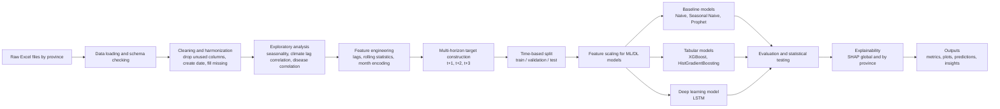

# 3. Methodology

## 3.1 Overview of Approach

Đồ án được thiết kế như một nghiên cứu thực nghiệm về dự báo chuỗi thời gian đa biến cho bệnh truyền nhiễm theo tháng tại cấp tỉnh, với trọng tâm là đánh giá vai trò của yếu tố khí hậu và so sánh hiệu quả giữa ba nhóm tiếp cận: (i) baseline đơn giản dựa trên lịch sử chuỗi, (ii) mô hình chuỗi thời gian cổ điển, và (iii) mô hình học máy/học sâu khai thác đặc trưng trễ. Kiến trúc tổng thể của hệ thống được triển khai dưới dạng một pipeline phân tích thống nhất, trong đó dữ liệu đầu vào được chuẩn hóa về cấu trúc theo từng tỉnh, sau đó đi qua các bước tiền xử lý, xây dựng đặc trưng, tạo nhãn đa bước dự báo, huấn luyện mô hình, đánh giá định lượng, và cuối cùng là phân tích khả giải mô hình bằng SHAP.

Về bản chất, đây là một pipeline nghiên cứu theo hướng "data-driven forecasting + explainability". Thành phần trung tâm của pipeline là bộ đặc trưng trễ và rolling statistics, đóng vai trò chuyển đổi dữ liệu chuỗi thời gian theo tỉnh thành một không gian đặc trưng có thể được sử dụng đồng thời bởi mô hình cây tăng cường (XGBoost, HistGradientBoosting), mô hình học sâu dạng LSTM, cũng như các baseline đối chứng. Kiến trúc này giúp bảo đảm tính nhất quán trong việc so sánh mô hình, vì tất cả các mô hình đều được đánh giá trên cùng một khung chia tập dữ liệu theo thời gian và cùng tập chỉ số đánh giá.

Hình dưới đây mô tả kiến trúc pipeline tổng thể của đồ án:



Ở mức kỹ thuật triển khai, đồ án được tổ chức thành các nhóm thành phần chính:

- `data_loader.py`: đọc dữ liệu thô từ nhiều tệp Excel theo tỉnh, kiểm tra cấu trúc cột, tạo trục thời gian và đồng bộ dữ liệu.
- `eda.py`: thực hiện phân tích khám phá dữ liệu ban đầu, bao gồm seasonality, phân phối của biến đích, tương quan trễ giữa biến khí hậu với bệnh, và tương quan giữa các bệnh.
- `feature_engineering.py`: xây dựng các đặc trưng trễ, rolling mean, rolling standard deviation và mã hóa chu kỳ tháng.
- `dataset_builder.py`: tạo nhãn dự báo nhiều bước (`t+1`, `t+2`, `t+3`) và tách tập huấn luyện/xác thực/kiểm tra theo thời gian.
- `models/*`: hiện thực các baseline Naive, Seasonal Naive, Prophet; mô hình tabular (XGBoost, HistGradientBoosting); và mô hình học sâu LSTM.
- `evaluation.py`: tính toán các chỉ số định lượng cho dự báo và kiểm định ý nghĩa thống kê.
- `shap_analysis.py` và `insight_extractor.py`: thực hiện giải thích mô hình và sinh mô tả insight tự động phục vụ báo cáo.

Vì đồ án được định hướng theo nghiên cứu thực nghiệm, pipeline không chỉ nhằm tối ưu độ chính xác dự báo mà còn nhằm trả lời ba câu hỏi nghiên cứu trọng tâm:

- Các mô hình có khai thác được tín hiệu vượt lên trên baseline đơn giản hay không?
- Các biến khí hậu và biến ngữ cảnh có thực sự bổ sung sức mạnh dự báo ngoài tín hiệu tự hồi quy của bệnh hay không?
- Trong điều kiện dữ liệu theo tỉnh có độ dài vừa phải, cách tiếp cận nào là phù hợp hơn: chuỗi thời gian cổ điển, supervised tabular learning, hay deep sequence learning?

## 3.2 Data & Data Pipeline

### 3.2.1 Nguồn dữ liệu, đơn vị quan sát và cấu trúc dữ liệu

Dữ liệu đầu vào được lưu trong thư mục `data/raw/` dưới dạng nhiều tệp Excel, mỗi tệp tương ứng với một tỉnh/thành phố. Theo cấu trúc hiện tại của đồ án, số lượng đơn vị không gian là 53 tỉnh. Mỗi quan sát được lập theo tháng, bao gồm hai chiều chỉ mục chính:

- `province`: đơn vị hành chính cấp tỉnh.
- `date`: thời điểm tháng, được tái tạo từ hai cột gốc `year` và `month`.

Khoảng thời gian của dữ liệu, theo phần mô tả hiện hành của dự án, kéo dài từ năm 1997 đến năm 2017. Như vậy, nếu toàn bộ chuỗi của tất cả các tỉnh là đầy đủ, số lượng quan sát theo hàng dữ liệu trước khi tạo đặc trưng có thể đạt mức khoảng hơn mười nghìn dòng. Tuy nhiên, số lượng chính xác cần được xác nhận lại trực tiếp từ tập dữ liệu đã xử lý hoặc từ tệp `data/processed/dataset_modeling.csv` để điền vào bản thảo cuối cùng.

Về nội dung biến, bộ dữ liệu đang hỗ trợ ba nhóm biến chính:

- Nhóm biến bệnh truyền nhiễm:
  - `Influenza_rates`, `Dengue_fever_rates`, `Diarrhoea_rates`
  - và trong một số tệp còn có các cột số ca tuyệt đối như `Influenza_cases`, `Dengue_fever_cases`, `Diarrhoea_cases`
- Nhóm biến khí hậu:
  - `Total_Evaporation`
  - `Total_Rainfall`
  - `Max_Daily_Rainfall`
  - `n_raining_days`
  - `Average_temperature`
  - `Average_Humidity`
  - `n_hours_sunshine`
- Nhóm biến xã hội và hạ tầng:
  - `poverty_rate`
  - `clean_water_rate_all`
  - `urban_water_usage_rate`
  - `toilet_rate`
  - `population_density`

Trong cấu hình hiện tại, biến mục tiêu mặc định là `Dengue_fever_rates`; tuy nhiên, pipeline được thiết kế để có thể cấu hình lại sang `Influenza_rates` hoặc `Diarrhoea_rates` mà không cần sửa mã nguồn. Ngoài ra, hệ thống cũng hỗ trợ tùy chọn tự tính biến đích theo dạng tỷ lệ trên 100.000 dân (`compute_rate_per100k`) từ số ca mắc và tổng dân số nam + nữ, nếu trong dữ liệu đầu vào không tồn tại cột tỷ lệ đã chuẩn hóa. Điểm này cho phép mở rộng các kịch bản phân tích trong tương lai, nhưng trong các chạy chính của đồ án, nhóm đã chủ động giữ cấu hình rate có sẵn để bảo đảm tính nhất quán với dữ liệu gốc.

Về mặt chất lượng dữ liệu, dữ liệu thuộc loại bảng quan sát thực địa tổng hợp theo tháng nên có thể tồn tại nhiễu do sai số báo cáo, chậm cập nhật, hoặc khác biệt về đặc trưng giữa các tỉnh. Dù mã nguồn hiện tại không triển khai bước phát hiện ngoại lệ chuyên biệt, pipeline đã xử lý tình huống thiếu giá trị thông qua nội suy theo hướng lan truyền trong từng tỉnh, giúp giảm độ gián đoạn của chuỗi mà vẫn giữ tính liên tục theo thời gian.

Lưu ý cho bản thảo cuối:
- [Cần bổ sung rõ nguồn gốc dữ liệu chính thức: ví dụ cơ quan y tế, cơ quan khí tượng, cổng dữ liệu mở, hay dữ liệu nhóm đã tổng hợp từ nghiên cứu trước.]
- [Cần bổ sung số lượng dòng dữ liệu chính xác trước và sau các bước tạo lag/rolling.]

### 3.2.2 Quy trình nạp dữ liệu và làm sạch

Quy trình xử lý dữ liệu được bắt đầu tại hàm `load_all_provinces()` trong `src/data_loader.py`. Quy trình này gồm các bước chính sau:

1. Duyệt toàn bộ tệp Excel trong thư mục đầu vào theo thứ tự ổn định.
2. Kiểm tra tính đầy đủ của hai cột cơ bản `year` và `month`; nếu thiếu, pipeline dừng và báo lỗi.
3. Loại bỏ các cột không mang ý nghĩa phân tích hoặc chỉ đóng vai trò chỉ mục kỹ thuật, cụ thể là:
   - `Unnamed: 0`
   - `year_month`
4. Tạo cột `province` từ tên tệp và tạo cột `date` dưới dạng chuẩn thời gian `YYYY-MM-01`.
5. Nếu biến mục tiêu chưa tồn tại nhưng cờ `compute_rate_per100k` được bật, hệ thống sẽ cố gắng xây dựng biến đích từ `cases_col` và tổng dân số:
   - `population_total = population_male + population_female`
   - `target = cases / population_total * 100000`
6. Ghép toàn bộ dữ liệu của các tỉnh thành một bảng thống nhất, sắp xếp theo `province` và `date`.
7. Trong từng tỉnh, áp dụng `forward fill` kết hợp `backward fill` để lấp giá trị thiếu, nhằm tránh làm mất mẫu dữ liệu trong các bước tạo đặc trưng trễ.

Việc nội suy theo từng tỉnh có ý nghĩa quan trọng về mặt phương pháp luận, vì nó bảo đảm rằng thông tin giữa các tỉnh không bị trộn lẫn trong bước xử lý thiếu dữ liệu. Đồng thời, thao tác sắp xếp theo `province` và `date` từ đầu cũng là nền tảng để các bước tạo lag và tạo nhãn nhiều bước phía sau không làm rò rỉ thông tin tương lai.

### 3.2.3 Phân tích khám phá dữ liệu (EDA)

Trước khi huấn luyện mô hình, pipeline thực hiện một giai đoạn phân tích khám phá tự động thông qua hàm `run_eda()` trong `src/eda.py`. Giai đoạn này nhằm kiểm tra các giả định quan trọng về tính mùa vụ, phân phối của biến đích, và quan hệ giữa bệnh với yếu tố khí hậu hoặc giữa các bệnh với nhau.

Các phân tích được thực hiện bao gồm:

- Hồ sơ mùa vụ theo tháng:
  - Tính trung bình giá trị mục tiêu theo từng tháng trong năm.
  - Lưu biểu đồ `seasonality_month_profile.png`.
- Phân phối của biến mục tiêu:
  - Dựng histogram kết hợp KDE.
  - Lưu biểu đồ `target_distribution.png`.
- Tương quan trễ giữa biến khí hậu và biến đích:
  - Với từng biến khí hậu, tính hệ số tương quan với biến đích tại các độ trễ từ 0 đến 6 tháng theo cấu trúc group-by từng tỉnh.
  - Lưu tệp `lag_correlation.csv` và heatmap `lag_correlation_heatmap.png`.
- Tương quan giữa các bệnh:
  - Tính ma trận tương quan đồng thời điểm giữa các cột bệnh có trong cấu hình `diseases`.
  - Lưu `disease_corr_matrix.csv` và `disease_corr_heatmap.png`.
- Tương quan chéo theo độ trễ giữa các bệnh:
  - Với mỗi cặp bệnh khác nhau, tính tương quan khi dịch trễ từ 0 đến 6 tháng.
  - Lưu `disease_crosscorr.csv` và `disease_crosscorr_heatmap.png`.

Các biểu đồ và bảng EDA có hai vai trò. Thứ nhất, chúng cung cấp bằng chứng thực nghiệm cho giả thuyết rằng dữ liệu có tính mùa vụ và có tác động trễ của yếu tố khí hậu. Thứ hai, chúng đóng vai trò cầu nối giữa kết quả định lượng của mô hình và diễn giải khoa học ở phần thảo luận.

### 3.2.4 Xây dựng đặc trưng

Bộ đặc trưng học máy được xây dựng bởi hàm `create_features()` trong `src/feature_engineering.py`. Các đặc trưng được thiết kế theo nguyên tắc chỉ sử dụng thông tin quá khứ để dự báo tương lai, nhằm tránh data leakage.

Các nhóm đặc trưng được sử dụng bao gồm:

- Đặc trưng trễ của bệnh đích:
  - Với danh sách lag cấu hình hiện tại `lags = [1, 2, 3]`, tạo các biến như:
    - `target_lag1`
    - `target_lag2`
    - `target_lag3`
- Đặc trưng trễ của biến khí hậu:
  - Mỗi biến khí hậu cũng được sinh các lag tương tự trong từng tỉnh.
- Đặc trưng trễ của biến xã hội:
  - Các biến xã hội cũng được tạo lag theo cơ chế nhất quán để mô hình tabular và LSTM có thể truy cập thông tin bối cảnh trễ.
- Đặc trưng bệnh khác (tùy chọn):
  - Nếu `include_other_diseases_as_features = true`, pipeline sẽ sinh thêm lag của hai bệnh còn lại ngoài bệnh đích.
  - Kịch bản này được dùng để kiểm tra giá trị dự báo liên bệnh nhưng không mặc định bật trong phân tích chính.
- Đặc trưng thống kê trượt:
  - `target_rollmean_3`
  - `target_rollstd_3`
  - Hai đặc trưng này được tính từ giá trị bệnh đích đã dịch lùi 1 bước, sau đó lấy trung bình và độ lệch chuẩn trên cửa sổ 3 tháng.
- Mã hóa mùa vụ:
  - `month_sin = sin(2π * month / 12)`
  - `month_cos = cos(2π * month / 12)`
  - Cách mã hóa này bảo toàn bản chất chu kỳ của tháng trong năm và tránh việc mô hình hiểu tháng 12 và tháng 1 là xa nhau một cách tuyến tính.

Sau khi tạo đầy đủ đặc trưng trễ và rolling, pipeline loại bỏ các dòng phát sinh giá trị thiếu do thao tác shift/rolling. Đây là bước cần thiết để bảo đảm mọi mô hình học máy làm việc trên một ma trận đặc trưng hoàn chỉnh.

### 3.2.5 Tạo nhãn dự báo nhiều bước và chia tập dữ liệu

Hàm `create_multi_horizon_targets()` trong `src/dataset_builder.py` tạo ra ba biến mục tiêu cho dự báo nhiều bước:

- `target_t+1`
- `target_t+2`
- `target_t+3`

Mỗi biến được sinh bằng cách dịch chuỗi bệnh đích theo hướng tương lai trong từng tỉnh. Vì vậy, mỗi mẫu huấn luyện tại thời điểm `t` được gắn với ba giá trị cần dự báo cho các tháng tiếp theo.

Sau đó, dữ liệu được chia theo thời gian bằng hàm `split_train_val_test()` như sau:

- Train: `date <= 2014-12-31`
- Validation: `2015-01-01 <= date <= 2015-12-31`
- Test: `2016-01-01 <= date <= 2017-12-31`

Việc chia theo thời gian thay vì chia ngẫu nhiên là yêu cầu bắt buộc đối với bài toán dự báo chuỗi thời gian, vì nó mô phỏng đúng tình huống triển khai thực tế: mô hình chỉ được học từ dữ liệu quá khứ và phải dự báo trên dữ liệu tương lai chưa từng thấy.

Ngoài ra, mã nguồn còn có một hàm `rolling_origin_folds()` phục vụ ý tưởng đánh giá rolling-origin theo thời gian. Tuy nhiên, trong phiên bản thực nghiệm chính hiện tại, hàm này mới đóng vai trò mở rộng tiềm năng và chưa phải một phần của giao thức đánh giá chính thức.

### 3.2.6 Chuẩn hóa đặc trưng

Đối với các mô hình supervised learning và deep learning, ma trận đặc trưng được chuẩn hóa bằng `StandardScaler` của scikit-learn. Điểm quan trọng là bộ chuẩn hóa chỉ được fit trên tập train, sau đó mới áp dụng sang validation và test:

- `x_train = fit_transform(train_features)`
- `x_val = transform(val_features)`
- `x_test = transform(test_features)`

Thiết kế này ngăn ngừa leakage từ validation/test vào quá trình học phân phối thống kê của dữ liệu.

Trong bước chọn cột đầu vào, pipeline loại bỏ các cột sau:

- `year`, `month`, `date`, `province`
- biến đích hiện tại
- ba cột nhãn tương lai `target_t+1`, `target_t+2`, `target_t+3`
- toàn bộ cột có hậu tố `_cases`

Quy tắc cuối cùng rất quan trọng. Khi biến mục tiêu đang là một biến theo dạng tỷ lệ (`*_rates`), việc giữ lại `*_cases` như một đặc trưng ở cùng thời điểm có thể tạo nên sự trùng lặp thông tin hoặc làm suy yếu tính diễn giải của mô hình. Vì vậy, các cột `_cases` được loại khỏi tập feature trong phiên bản hiện tại để bảo đảm tính nhất quán phương pháp.

## 3.3 Evaluation Protocol

### 3.3.1 Thiết kế kế hoạch đánh giá

Kế hoạch đánh giá của đồ án được xây dựng nhằm trả lời đồng thời ba loại câu hỏi:

- Mô hình nào dự báo chính xác hơn về mặt định lượng?
- Mô hình có vượt được baseline đơn giản hay không?
- Các kết quả có khả năng diễn giải và có ý nghĩa cho bài toán giám sát dịch tễ hay không?

Để phục vụ các câu hỏi trên, đồ án lựa chọn giao thức đánh giá nhiều tầng:

- Tầng 1: đánh giá tổng thể trên test set bằng các metric sai số chuẩn cho dự báo hồi quy.
- Tầng 2: đánh giá khả năng phát hiện đợt bùng phát thông qua precision và recall ở ngưỡng percentile cao.
- Tầng 3: đánh giá theo tỉnh bằng MAE nhằm xem xét độ ổn định không gian.
- Tầng 4: kiểm định ý nghĩa thống kê so với baseline mạnh nhất trong nhóm đơn giản.
- Tầng 5: đánh giá định tính bằng SHAP, heatmap lag và tương quan liên bệnh.

Thiết kế này giúp phần đánh giá không dừng ở một bảng số liệu tổng, mà mở rộng sang bình diện phân tích khoa học và khả năng ứng dụng thực tế.

### 3.3.2 Chỉ số đánh giá

Đồ án sử dụng các chỉ số sau:

#### a) MAE theo từng horizon

Sai số tuyệt đối trung bình được tính cho từng bước dự báo:

- `MAE@1`
- `MAE@2`
- `MAE@3`

MAE được chọn làm chỉ số chính để so sánh mô hình vì dễ diễn giải, bền hơn RMSE trước ngoại lệ lớn, và phản ánh trực tiếp độ lệch dự báo trung bình.

#### b) RMSE theo từng horizon

`RMSE@1`, `RMSE@2`, `RMSE@3` được dùng để phản ánh mức độ nhạy của mô hình trước các sai số lớn. Đây là chỉ số bổ sung quan trọng trong bối cảnh dữ liệu dịch tễ có thể xuất hiện các đỉnh dịch hoặc outlier theo mùa.

#### c) SMAPE theo từng horizon

SMAPE được dùng để chuẩn hóa sai số theo quy mô của giá trị thực tế và dự báo. Chỉ số này đặc biệt hữu ích khi so sánh các chuỗi có biên độ khác nhau giữa các tỉnh.

#### d) Chỉ số outbreak detection

Ngoài bài toán hồi quy, đồ án còn đánh giá khả năng nhận diện các tháng bùng phát dịch bằng cách:

- Xác định ngưỡng outbreak là percentile thứ 95 của giá trị thực trên horizon 1.
- Chuyển đầu ra thành nhãn nhị phân: outbreak hoặc non-outbreak.
- Tính:
  - `precision`
  - `recall`

Thiết kế này giúp gắn kết bài toán dự báo với nhu cầu thực tế của hệ thống giám sát dịch, nơi việc nhận biết đỉnh dịch sớm thường có ý nghĩa quan trọng hơn chỉ số sai số trung bình thuần túy.

#### e) MAE theo tỉnh

Sau khi chọn được mô hình tốt nhất theo `MAE@1`, pipeline tiếp tục tính MAE riêng cho từng tỉnh và lưu kết quả vào `province_metrics.csv`. Bảng này hỗ trợ phân tích:

- mô hình hoạt động tốt ở những tỉnh nào,
- tỉnh nào khó dự báo hơn,
- liệu hiệu năng có đồng đều trên toàn bộ không gian nghiên cứu hay không.

### 3.3.3 Baselines và benchmarks

Để bảo đảm bài toán có ý nghĩa khoa học, đồ án so sánh mô hình đề xuất với ba mức baseline:

#### a) Naive baseline

Mô hình Naive dự báo giá trị tương lai bằng giá trị gần nhất trong quá khứ:

- dự báo tại `t+h` được gán bằng giá trị tại `t+h-h = t`

Đây là baseline tối thiểu để kiểm tra xem mô hình học máy có thực sự học được cấu trúc hay không.

#### b) Seasonal Naive baseline

Mô hình Seasonal Naive dự báo theo cùng tháng của năm trước:

- dự báo `t+h` bằng quan sát tại `t-12+h-1`

Baseline này phù hợp với các chuỗi có tính mùa vụ mạnh và thường là một đối thủ đáng gờm hơn Naive trong các bài toán dịch tễ theo tháng.

#### c) Prophet

Prophet được sử dụng như một baseline chuỗi thời gian theo tỉnh. Mỗi tỉnh được fit một mô hình riêng với:

- `yearly_seasonality = True`
- `weekly_seasonality = False`
- `daily_seasonality = False`

Nếu một tỉnh có dưới 24 quan sát train, pipeline rút về dự báo hằng bằng giá trị cuối cùng để tránh fit một mô hình chuỗi thời gian không đủ dữ liệu.

### 3.3.4 Kiểm định ý nghĩa thống kê

Sau khi thu được sai số tuyệt đối của từng mô hình trên horizon 1, hệ thống thực hiện kiểm định Wilcoxon signed-rank giữa sai số của từng mô hình và sai số của Seasonal Naive. Seasonal Naive được chọn làm đối chứng vì đây là baseline phản ánh trực tiếp tính mùa vụ của chuỗi, do đó khắt khe hơn Naive thông thường.

Việc bổ sung kiểm định ý nghĩa thống kê giúp kết luận "mô hình tốt hơn baseline" không chỉ dựa trên chênh lệch số học trung bình, mà còn được hỗ trợ bởi một phép kiểm định phi tham số phù hợp với sai số không nhất thiết phân phối chuẩn.

### 3.3.5 Kịch bản đánh giá

Do pipeline hỗ trợ nhiều cấu hình, đồ án có thể được đánh giá theo nhiều kịch bản, ví dụ:

- Thay đổi bệnh đích:
  - `Dengue_fever_rates`
  - `Influenza_rates`
  - `Diarrhoea_rates`
- Bật hoặc tắt chuẩn hóa tự tính theo 100.000 dân:
  - `compute_rate_per100k = true/false`
- Bật hoặc tắt thông tin liên bệnh:
  - `include_other_diseases_as_features = true/false`

Trong phiên bản thực nghiệm chính của đồ án, hai kịch bản thường được ưu tiên là:

- Kịch bản cơ sở: chỉ dùng bệnh đích và biến khí hậu/xã hội.
- Kịch bản liên bệnh: bổ sung lag của các bệnh còn lại để kiểm tra giá trị dự báo liên bệnh.

Thiết kế kịch bản như vậy cho phép so sánh không chỉ giữa các mô hình, mà còn giữa các cách biểu diễn đầu vào.

## 3.4 System Design / Model Design

### 3.4.1 Cơ sở lựa chọn mô hình

Đồ án không giả định trước rằng deep learning sẽ luôn vượt trội. Thay vào đó, nhóm lựa chọn ba họ mô hình khác nhau để phản ánh ba hướng tiếp cận phổ biến trong dự báo dịch tễ:

- Chuỗi thời gian đơn biến hoặc bán cấu trúc:
  - Naive
  - Seasonal Naive
  - Prophet
- Học có giám sát trên dữ liệu tabular:
  - XGBoost
  - HistGradientBoosting
- Học sâu trên chuỗi nhiều biến:
  - LSTM

Lý do của cách chọn này là để trả lời một câu hỏi nghiên cứu có ý nghĩa: với dữ liệu theo tỉnh, độ dài vừa phải, đặc trưng khí hậu và bệnh có độ trễ, thì mô hình nào là phù hợp nhất?

### 3.4.2 Thiết kế baseline

Hai baseline Naive và Seasonal Naive được triển khai theo cách rất rõ ràng, không có giai đoạn huấn luyện:

- `naive_predict()` sử dụng `groupby(province).shift(horizon)`.
- `seasonal_naive_predict()` sử dụng `groupby(province).shift(12 + horizon - 1)`.

Điểm mạnh của hai baseline này là:

- cực kỳ dễ diễn giải,
- đặt ra mức chuẩn tối thiểu cho bài toán,
- giúp đánh giá xem mô hình phức tạp có thực sự cần thiết hay không.

### 3.4.3 Thiết kế mô hình Prophet

Prophet được triển khai theo từng tỉnh. Điều này có nghĩa là pipeline không học một mô hình Prophet dùng chung cho toàn bộ tỉnh, mà fit từng chuỗi riêng lẻ để giữ đúng giả định của mô hình chuỗi thời gian cổ điển.

Quy trình của Prophet gồm:

- lấy dữ liệu `date` và biến mục tiêu của một tỉnh,
- đổi tên thành cặp cột `ds`, `y`,
- fit mô hình Prophet có seasonality năm,
- dự báo trực tiếp trên mốc thời gian test của tỉnh đó.

Đây là mốc so sánh quan trọng để đối chiếu với các mô hình có khả năng học đặc trưng chéo tỉnh.

### 3.4.4 Thiết kế mô hình tabular

#### a) XGBoost

XGBoost được chọn vì:

- phù hợp với dữ liệu tabular có feature engineering thủ công,
- học tốt quan hệ phi tuyến,
- tương đối bền trước các thang đo khác nhau sau khi chuẩn hóa,
- thường là baseline mạnh trong các nghiên cứu dự báo dữ liệu cấu trúc.

Mỗi horizon được huấn luyện bằng một mô hình riêng. Điều này có nghĩa là bài toán đa bước không được giải bằng một mô hình đầu ra vector duy nhất cho XGBoost, mà bằng ba mô hình hồi quy độc lập:

- mô hình cho `t+1`
- mô hình cho `t+2`
- mô hình cho `t+3`

Thiết kế này giúp mỗi mô hình tối ưu riêng cho từng tầm dự báo và đơn giản hóa việc diễn giải.

#### b) HistGradientBoosting

HistGradientBoosting đóng vai trò đối chứng tabular thứ hai, với ưu điểm:

- huấn luyện nhanh,
- hoạt động tốt trên bộ dữ liệu tabular cỡ vừa,
- ít yêu cầu tinh chỉnh hơn boosting cổ điển trong nhiều trường hợp.

Tương tự XGBoost, mỗi horizon được huấn luyện độc lập.

#### c) Cơ chế tối ưu siêu tham số nhanh trên validation

Trong `run_all.py`, đồ án triển khai một bước tuning nhẹ trên validation set cho XGBoost và HistGradientBoosting. Cụ thể:

- XGBoost được so sánh trên một lưới tham số nhỏ gồm các tổ hợp của:
  - `max_depth`
  - `learning_rate`
  - `subsample`
  - `colsample_bytree`
- HistGradientBoosting được so sánh trên lưới:
  - `max_iter`
  - `learning_rate`
  - `max_depth`

Tiêu chí chọn mô hình tốt nhất là `MAE@1` trên validation set. Sau khi chọn được cấu hình tốt nhất, mô hình sẽ được huấn luyện lại trên tập gộp `train + validation` trước khi đánh giá trên test set.

Thiết kế này cân bằng giữa:

- yêu cầu nghiên cứu cần có bước tuning,
- và yêu cầu thực tế của đồ án là giữ pipeline gọn, tái lập được, và không quá nặng.

### 3.4.5 Thiết kế mô hình LSTM

Mô hình LSTM được xây dựng trong `src/models/lstm_model.py` với kiến trúc:

- đầu vào: chuỗi nhiều bước gồm các vector đặc trưng đã chuẩn hóa,
- phần thân: `nn.LSTM`
  - `hidden_size = 128` (mặc định hiện tại ở mã nguồn của mô hình)
  - `num_layers = 2`
  - `dropout = 0.2` nếu số tầng lớn hơn 1
- đầu ra:
  - một lớp tuyến tính `Linear(hidden_size, out_dim)`
  - `out_dim = 3`, tương ứng với ba horizon dự báo.

LSTM được chọn nhằm đại diện cho nhóm mô hình học sâu chuỗi nhiều biến, nơi mô hình có khả năng tự học cấu trúc thời gian và tương tác phi tuyến giữa các biến thay vì phụ thuộc hoàn toàn vào feature engineering thủ công.

Trong quá trình thực nghiệm, dữ liệu đầu vào cho LSTM được tạo bằng cửa sổ trượt (`sliding window`) với:

- `seq_len = 24` trong cấu hình tối ưu hóa gần nhất

Nói cách khác, mỗi mẫu đầu vào cho LSTM bao gồm 24 bước thời gian liên tiếp trong không gian đặc trưng; nhãn tương ứng là bộ giá trị `t+1`, `t+2`, `t+3` tại thời điểm cuối của cửa sổ.

Lưu ý phương pháp luận:
- Phiên bản mã hiện tại tạo chuỗi bằng cách áp cửa sổ trượt trên ma trận đặc trưng đã được sắp xếp theo `province`, `date`. Trong bản thảo cuối, nhóm nên kiểm tra lại và mô tả rõ rằng cửa sổ LSTM được ràng buộc trong từng tỉnh, hoặc chỉnh mã nếu cần, để tránh khả năng một cửa sổ vô tình cắt qua ranh giới hai tỉnh liên tiếp trong bảng dữ liệu đã gộp.

### 3.4.6 Thiết kế giải thích mô hình

Để tăng tính diễn giải khoa học, đồ án tích hợp SHAP cho mô hình XGBoost tại horizon 1. Đây là mô hình tabular mạnh và phù hợp với phân tích importance.

Quy trình giải thích gồm:

- Tạo `shap.Explainer(model, x_background)`
- Tính SHAP value trên test set
- Lưu:
  - `shap_summary.png`
  - `top_features.csv`
- Tiếp tục tính SHAP theo từng tỉnh bằng cách lấy trung bình trị tuyệt đối của SHAP value trong từng tỉnh và lưu `shap_by_province.csv`
- Từ hai bảng này, một script đơn giản sinh ra `insights.txt` với ba nhóm nhận xét:
  - đặc trưng quan trọng toàn cục
  - dấu hiệu của hiệu ứng trễ
  - dị biệt theo vùng/tỉnh

Điểm quan trọng ở đây là đồ án không dừng lại ở câu hỏi "mô hình nào tốt nhất", mà còn mở rộng sang "vì sao mô hình học được như vậy" và "yếu tố nào đóng góp mạnh nhất vào dự báo".

## 3.5 Training & Implementation Details

### 3.5.1 Quy trình huấn luyện tổng thể

Quy trình huấn luyện và thực thi được điều phối tập trung tại `run_all.py`. Trình tự triển khai như sau:

1. Đọc cấu hình từ `configs/default.yaml`.
2. Tạo các thư mục đầu ra cần thiết.
3. Nạp dữ liệu của toàn bộ tỉnh và thực hiện EDA.
4. Tạo đặc trưng trễ, rolling, month encoding.
5. Tạo nhãn đa horizon.
6. Chia dữ liệu thành train/validation/test theo thời gian.
7. Chuẩn hóa đặc trưng bằng `StandardScaler`.
8. Tạo dự báo từ baseline Naive và Seasonal Naive.
9. Nếu được bật trong cấu hình, huấn luyện Prophet theo từng tỉnh.
10. Thực hiện grid search nhẹ trên validation cho XGBoost và HistGradientBoosting.
11. Huấn luyện lại hai mô hình tabular tốt nhất trên tập train + validation.
12. Xây dựng chuỗi đầu vào cho LSTM và huấn luyện bằng mini-batch.
13. Tính toàn bộ metrics, lưu kết quả dự báo, vẽ biểu đồ cho hai mô hình tốt nhất.
14. Nếu được bật, chạy SHAP và sinh insight tự động.

Thiết kế này bảo đảm toàn bộ pipeline có thể được chạy lại bằng một lệnh duy nhất:

```bash
python run_all.py --config configs/default.yaml
```

### 3.5.2 Chi tiết huấn luyện XGBoost và HistGradientBoosting

Đối với XGBoost, cấu hình mặc định trong `src/models/tree_models.py` bao gồm:

- `n_estimators = 300`
- `max_depth = 6`
- `learning_rate = 0.05`
- `subsample = 0.8`
- `colsample_bytree = 0.8`
- `objective = reg:squarederror`
- `random_state = 42`

Đối với HistGradientBoosting, cấu hình mặc định gồm:

- `max_iter = 300`
- `random_state = 42`

Tuy nhiên, như đã trình bày ở trên, pipeline không cố định hoàn toàn các giá trị này. Trước khi huấn luyện cuối cùng, hệ thống dùng validation set để thử một tập nhỏ các cấu hình và chọn cấu hình có `MAE@1` thấp nhất.

Sau khi chọn tham số, dữ liệu train và validation được ghép lại:

- `x_trainval = [x_train; x_val]`
- `y_trainval = [y_train; y_val]`

Mỗi horizon được huấn luyện thành một mô hình riêng biệt. Đây là một chi tiết thực thi quan trọng, vì nó nghĩa là đồ án đang sử dụng chiến lược multi-output theo kiểu "multiple single-output regressors" cho các mô hình tabular.

### 3.5.3 Chi tiết huấn luyện LSTM

Quy trình huấn luyện LSTM được hiện thực trong `src/trainer.py` và `run_all.py`. Các lựa chọn tối ưu hóa hiện tại gồm:

- thuật toán tối ưu: `AdamW`
- learning rate mặc định:
  - `lr = 1e-3`
- regularization:
  - `weight_decay = 1e-4`
- batch size:
  - `batch_size = 64`
- số epoch tối đa:
  - `epochs = 60`
- early stopping:
  - theo validation loss
  - `patience = 8`
- gradient clipping:
  - `clip_grad_norm_ = 1.0`

Huấn luyện được tiến hành theo mini-batch trên tập chuỗi đầu vào. Sau mỗi epoch, mô hình được đánh giá trên validation set. Nếu validation loss không cải thiện trong số epoch cho phép, pipeline sẽ nạp lại trọng số tốt nhất và dừng sớm.

Thiết kế này được lựa chọn vì:

- phù hợp với dữ liệu không quá lớn,
- giúp giảm overfitting so với huấn luyện full-batch,
- tạo một phiên bản LSTM đủ mạnh để so sánh công bằng với mô hình tabular, nhưng vẫn giữ độ đơn giản cần thiết cho một đồ án thực nghiệm.

### 3.5.4 Chi tiết lưu trữ kết quả và khả tái lập

Pipeline lưu kết quả đầu ra theo cấu trúc chuẩn:

- `outputs/metrics/`
  - `model_comparison.csv`
  - `province_metrics.csv`
  - `significance_vs_seasonal.csv`
- `outputs/predictions/`
  - `pred_<Model>.csv`
- `outputs/plots/`
  - biểu đồ EDA và biểu đồ dự báo
- `outputs/shap/`
  - các tệp SHAP và insight

Thiết kế này có ý nghĩa thực tiễn lớn đối với viết báo cáo, vì:

- mọi bảng kết quả chính đều đã được trích xuất sang CSV,
- các hình minh họa được lưu thành file độc lập để chèn trực tiếp vào luận văn/bài báo,
- đầu ra dự báo cho từng mô hình được giữ lại để tái kiểm tra hoặc phân tích lỗi sau này.

Ngoài ra, một số chi tiết hỗ trợ tái lập thí nghiệm đã được chuẩn hóa trong mã:

- `random_state = 42` cho mô hình tabular
- cấu hình tập trung trong `configs/default.yaml`
- một script chạy chính duy nhất là `run_all.py`

### 3.5.5 Công cụ, thư viện và môi trường triển khai

Đồ án được hiện thực hoàn toàn bằng Python. Các thư viện chính bao gồm:

- `pandas`, `numpy`:
  - xử lý dữ liệu dạng bảng và tính toán số học
- `scikit-learn`:
  - chuẩn hóa dữ liệu
  - chỉ số đánh giá
  - HistGradientBoostingRegressor
- `xgboost`:
  - XGBRegressor
- `prophet`:
  - baseline chuỗi thời gian theo tỉnh
- `torch`:
  - xây dựng và huấn luyện LSTM
- `scipy`:
  - kiểm định Wilcoxon
- `matplotlib`, `seaborn`:
  - trực quan hóa dữ liệu và kết quả
- `shap`:
  - giải thích mô hình
- `openpyxl`:
  - đọc dữ liệu Excel
- `PyYAML`:
  - nạp cấu hình từ file YAML

Về phần cứng, mã nguồn hiện tại không lưu thông tin thiết bị chạy. Trong bản thảo cuối, nhóm nên bổ sung:

- [CPU model]
- [RAM]
- [Có/không sử dụng GPU cho PyTorch]
- [Phiên bản Python và hệ điều hành]

### 3.5.6 Tóm tắt logic phương pháp

Tổng hợp lại, logic phương pháp của đồ án gồm các ý chính:

- xây dựng một pipeline thống nhất cho dữ liệu đa tỉnh, đa biến, đa horizon;
- so sánh công bằng giữa baseline đơn giản, mô hình chuỗi thời gian cổ điển, mô hình tabular và mô hình học sâu;
- ưu tiên thiết kế đặc trưng trễ và đánh giá theo thời gian để phản ánh đúng bối cảnh dự báo thực tế;
- kết hợp đánh giá định lượng với giải thích mô hình và phân tích tương quan để tạo ra giá trị nghiên cứu thay vì chỉ cung cấp độ chính xác dự báo.

Theo định hướng này, phần Methodology không chỉ mô tả cách hiện thực mô hình, mà còn cho thấy vì sao pipeline được tổ chức như hiện tại: nhằm tối đa hóa tính so sánh, tính minh bạch, và tính tái lập của nghiên cứu.
